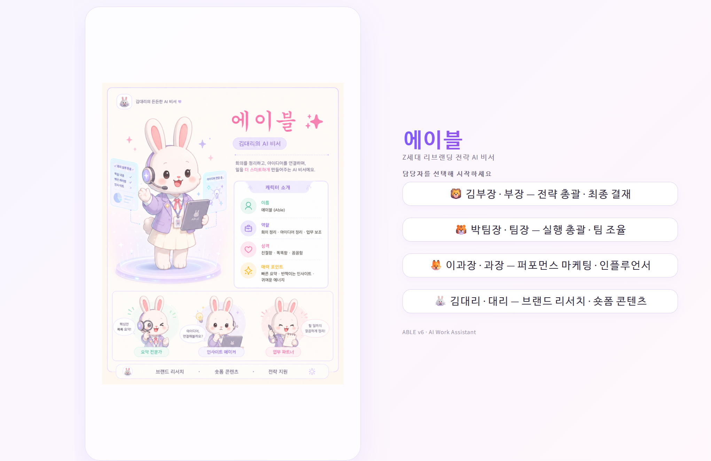
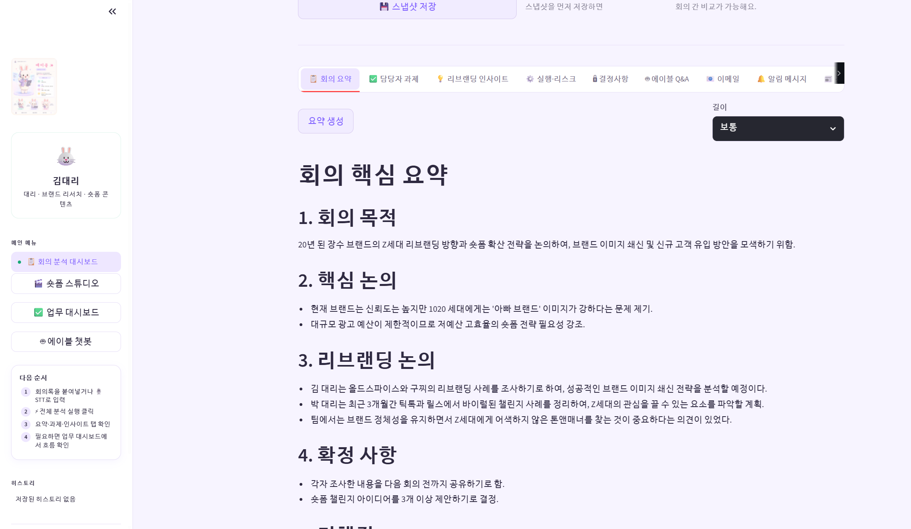
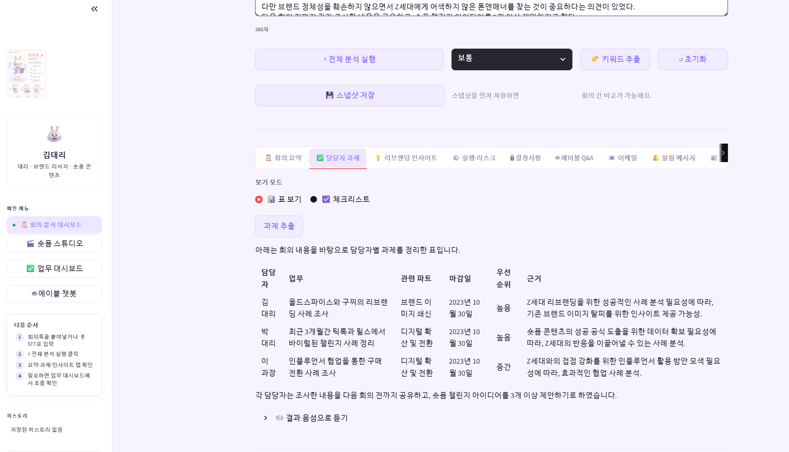
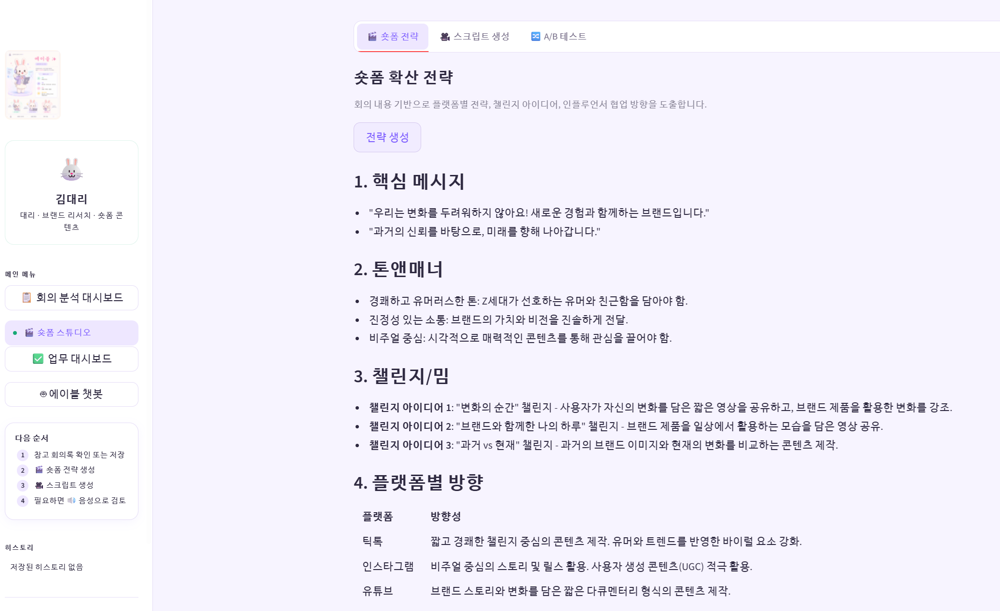
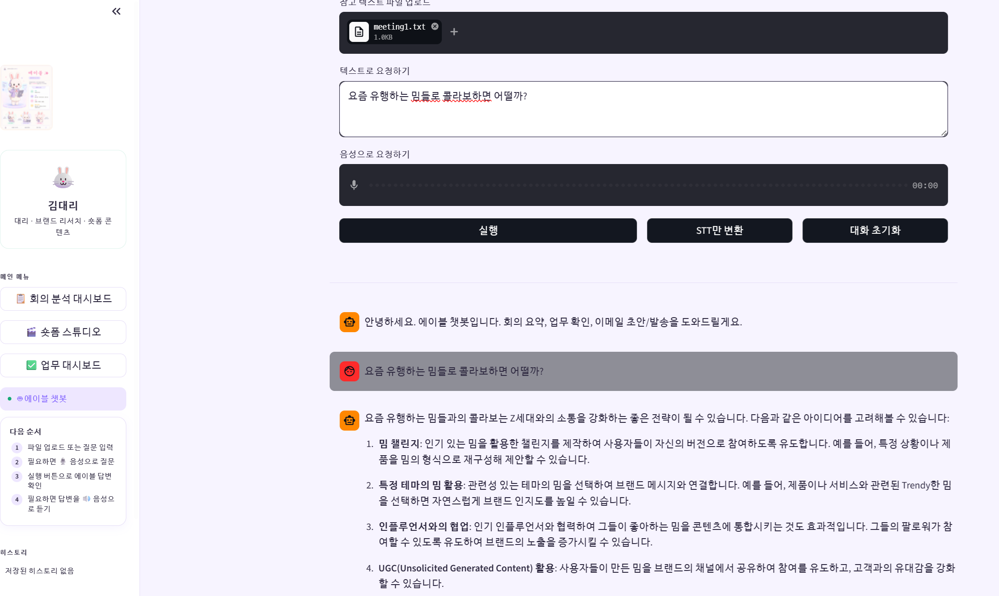

# AIVLE AI Assistant

OpenAI API 기반 회의록 분석·업무 추출 AI 개인비서 웹앱입니다.  
회의록을 업로드하거나 음성으로 입력하면 회의 요약, 담당자별 업무 추출, 리브랜딩 전략 인사이트, 숏폼 콘텐츠 전략, 업무 대시보드, 챗봇, 이메일 브리핑 기능을 제공합니다.

본 프로젝트에서 Streamlit 기반 웹앱 구현을 담당했습니다.

---

## 1. 프로젝트 개요

외부 미팅이나 회의 불참으로 인해 긴 회의록을 다시 읽어야 하는 실무자가 빠르게 업무 맥락을 복구할 수 있도록 만든 AI 업무 보조 서비스입니다.

단순 회의 요약기가 아니라, 회의 내용을 바탕으로 다음 항목을 한 번에 정리하는 것을 목표로 했습니다.

- 회의 핵심 요약
- 담당자별 업무 추출
- 마감일 및 우선순위 정리
- 리브랜딩 전략 인사이트
- 숏폼 콘텐츠 전략 및 스크립트 생성
- 업무 진행 상태 관리
- 이메일 브리핑 생성 및 발송
- 음성 입력(STT) 및 음성 출력(TTS)

---

## 2. 문제 정의

회의에 참석하지 못한 실무자는 긴 회의록을 읽고 다음 내용을 직접 파악해야 합니다.

- 회의의 핵심 논의 내용
- 본인에게 배정된 업무
- 담당자별 역할
- 마감기한
- 후속 조사 방향
- 팀장에게 보고할 내용

이 과정은 시간이 오래 걸리고, 업무 누락 가능성도 있습니다.  
따라서 회의록에서 업무 맥락과 실행 항목을 자동으로 정리해주는 AI 개인비서가 필요하다고 판단했습니다.

---

## 3. 서비스 시나리오

본 프로젝트는 `20년 된 장수 브랜드의 Z세대 리브랜딩 전략 수립`이라는 가상 업무 상황을 기반으로 구성했습니다.

예시 사용자 김대리는 외부 미팅으로 핵심 회의에 불참했습니다.  
에이블은 김대리가 회의 내용을 빠르게 파악하고, 본인 업무와 조사 방향을 확인한 뒤, 팀장에게 보낼 이메일 브리핑까지 작성할 수 있도록 돕습니다.

---

## 4. 주요 기능

### 4.1 역할 기반 로그인

사용자는 역할을 선택해 로그인할 수 있습니다.

- 김부장: 전략 총괄 · 최종 결재
- 박팀장: 실행 총괄 · 팀 조율
- 이과장: 퍼포먼스 마케팅 · 인플루언서
- 김대리: 브랜드 리서치 · 숏폼 콘텐츠

역할에 따라 접근 가능한 메뉴와 기능을 다르게 구성했습니다.

---

### 4.2 회의 분석 대시보드

회의록을 입력하거나 txt/md 파일로 업로드할 수 있습니다.

제공 기능:

- 회의록 업로드
- 회의록 직접 입력
- STT 기반 음성 회의록 변환
- 회의 요약
- 담당자별 업무 추출
- 리브랜딩 인사이트 생성
- 실행 계획 및 리스크 정리
- 결정사항 추출
- 회의 스냅샷 저장
- 이전 회의와 현재 회의 비교

---

### 4.3 업무 대시보드

회의록에서 추출된 업무를 관리할 수 있는 대시보드입니다.

제공 기능:

- 업무 자동 추출
- 담당자, 업무명, 설명, 마감일, 우선순위, 상태 관리
- 진행 예정 / 진행 중 / 검토 중 / 완료 상태 구분
- 업무 완료율 표시
- 편집 테이블
- 카드 보기
- 업무 흐름 보기

---

### 4.4 숏폼 스튜디오

회의 내용을 기반으로 Z세대 타깃 숏폼 전략을 생성합니다.

제공 기능:

- 숏폼 확산 전략 생성
- 60초 숏폼 스크립트 생성
- A/B 테스트 아이디어 생성
- 결과 TXT 다운로드
- TTS 음성 출력

---

### 4.5 에이블 챗봇

현재 앱의 회의록, 분석 결과, 업무 목록을 참고해 답변하는 챗봇입니다.

제공 기능:

- 텍스트 질문
- 음성 질문 STT 변환
- 참고 텍스트 파일 업로드
- 회의 요약 및 업무 확인
- 이메일 초안 작성
- SendGrid 기반 이메일 발송
- TTS 음성 응답

---

### 4.6 뉴스/사례 추천 예시 생성

회의 내용과 키워드를 바탕으로 리브랜딩, 숏폼, Z세대 마케팅과 관련된 뉴스/사례 추천 예시를 생성합니다.

현재 버전은 실제 뉴스 검색 API 기반이 아니라 LLM을 활용한 추천 예시 생성입니다.  
향후 실제 검색 API와 연동해 출처, 날짜, URL 검증 기능을 추가할 예정입니다.

---

## 5. 본인 구현 범위

본 프로젝트에서 담당한 구현 범위는 다음과 같습니다.

- Streamlit 기반 멀티페이지 웹앱 구조 구현
- 역할 기반 로그인 및 페이지 접근 흐름 구성
- 회의 분석 대시보드 구현
- OpenAI API 기반 회의 요약, 업무 추출, 전략 인사이트 생성 로직 구현
- Whisper STT 기반 음성 입력 기능 구현
- OpenAI TTS 기반 음성 출력 기능 구현
- 담당자별 업무 대시보드 구현
- 업무 상태, 우선순위, 마감일 관리 기능 구현
- 숏폼 전략·스크립트·A/B 테스트 생성 페이지 구현
- 앱 상태를 참고하는 챗봇 구현
- SendGrid API 기반 이메일 발송 기능 구현
- HTML/CSS 기반 UI 커스터마이징

---

## 6. 기술 스택

| 구분 | 사용 기술 |
|---|---|
| Language | Python |
| Web Framework | Streamlit |
| AI API | OpenAI API |
| STT | Whisper API |
| TTS | OpenAI TTS |
| Email | SendGrid API |
| Data Handling | pandas, JSON |
| UI | HTML, CSS |
| State Management | Streamlit session_state |

---

## 7. 프로젝트 구조

```text
aivle-ai-assistant/
├─ app.py
├─ shared.py
├─ pages/
│  ├─ 1_dashboard.py
│  ├─ 2_shortform.py
│  ├─ 3_tasks.py
│  └─ 4_chatbot.py
├─ assets/
│  └─ able_bunny.png
├─ docs/
│  ├─ architecture.md
│  ├─ setup.md
│  ├─ retrospective.md
│  └─ screenshots/
├─ sample_data/
│  └─ sample_meeting.txt
├─ requirements.txt
├─ .gitignore
├─ .env.example
└─ README.md
```

---

## 8. 실행 방법

### 8.1 저장소 클론

```bash
git clone [repository-url]
cd aivle-ai-assistant
```

### 8.2 패키지 설치

```bash
pip install -r requirements.txt
```

### 8.3 환경변수 설정

Streamlit secrets 또는 OS 환경변수로 API 키를 설정합니다.

#### 방법 1. Streamlit secrets 사용

`.streamlit/secrets.toml` 파일을 생성합니다.

```toml
OPENAI_API_KEY = "your_openai_api_key"
SENDGRID_API_KEY = "your_sendgrid_api_key"
EMAIL_ADDRESS = "your_verified_sender@example.com"
```

#### 방법 2. Windows PowerShell 환경변수 사용

```powershell
$env:OPENAI_API_KEY="your_openai_api_key"
$env:SENDGRID_API_KEY="your_sendgrid_api_key"
$env:EMAIL_ADDRESS="your_verified_sender@example.com"
```

#### 방법 3. Windows CMD 환경변수 사용

```cmd
set OPENAI_API_KEY=your_openai_api_key
set SENDGRID_API_KEY=your_sendgrid_api_key
set EMAIL_ADDRESS=your_verified_sender@example.com
```

---

### 8.4 앱 실행

```bash
streamlit run app.py
```

---

## 9. 시연 흐름

1. 담당자 선택 후 로그인
2. 회의록 txt 파일 업로드 또는 직접 입력
3. 전체 분석 실행
4. 회의 요약 확인
5. 담당자별 업무 확인
6. 리브랜딩·숏폼 전략 확인
7. 업무 대시보드에서 상태 관리
8. 챗봇으로 추가 질문
9. 이메일 브리핑 생성 및 발송

---

## 10. 시연 화면

본 프로젝트는 회의록 입력부터 분석, 업무 추출, 전략 생성, 업무 관리, 이메일 브리핑까지 하나의 업무 흐름으로 연결되도록 구현했습니다.

| 화면 | 설명 |
|---|---|
| 로그인 화면 | 사용자 역할을 선택해 서비스에 진입하는 화면입니다. 김부장, 박팀장, 이과장, 김대리 등 역할별 접근 흐름을 구성했습니다. |
| 회의 분석 대시보드 | 회의록을 직접 입력하거나 txt/md 파일로 업로드한 뒤, 회의 요약·담당자별 업무·리브랜딩 인사이트·결정사항을 생성하는 핵심 화면입니다. |
| STT 음성 입력 | 음성 회의록을 텍스트로 변환해 기존 회의 분석 흐름과 연결하는 기능입니다. 회의 내용을 직접 입력하지 않아도 분석을 시작할 수 있도록 구성했습니다. |
| 업무 대시보드 | 회의록에서 추출된 업무를 담당자, 마감일, 우선순위, 진행 상태 기준으로 관리하는 화면입니다. 진행 예정, 진행 중, 검토 중, 완료 상태와 전체 완료율을 확인할 수 있습니다. |
| 숏폼 스튜디오 | 회의 내용을 바탕으로 Z세대 타깃 숏폼 전략, 60초 스크립트, A/B 테스트 아이디어를 생성하는 화면입니다. |
| 에이블 챗봇 | 현재 회의록, 분석 결과, 업무 목록을 참고해 사용자의 질문에 답변하는 챗봇 화면입니다. 텍스트 질문, 음성 질문, 이메일 초안 작성 및 발송 기능을 포함했습니다. |
| 이메일 브리핑 | 회의 요약과 담당자별 업무를 이메일 형태로 정리해 공유할 수 있는 기능입니다. SendGrid API를 활용해 발송 흐름을 구현했습니다. |

### 화면 예시

  
**역할 기반 로그인 화면**  
사용자의 직급과 담당 역할을 선택해 서비스에 진입하는 화면입니다. 역할별 권한과 접근 가능한 기능을 다르게 구성했습니다.

  
**회의 분석 대시보드**  
회의록 업로드, STT 입력, 전체 분석 실행을 통해 회의 요약·업무 추출·전략 인사이트를 생성하는 핵심 화면입니다.

  
**업무 대시보드**  
회의록에서 추출된 업무를 담당자, 마감일, 우선순위, 진행 상태 기준으로 관리하는 화면입니다. 업무 진행률과 병목 구간을 확인할 수 있습니다.

  
**숏폼 스튜디오**  
회의 내용을 기반으로 숏폼 확산 전략, 60초 스크립트, A/B 테스트 아이디어를 생성하는 화면입니다.

  
**에이블 챗봇**  
현재 앱의 회의록, 분석 결과, 업무 목록을 참고해 질문에 답변하는 챗봇 화면입니다. 텍스트와 음성 질문을 모두 지원합니다.

세부 기능별 실행 화면은 `![docs/screenshots/]`[docs/screenshots](https://github.com/Jaeukss/https-github.com-ukss-minip3/tree/main/docs/screenshots) 폴더에 정리했습니다.

## 11. 프로젝트 결과

본 프로젝트를 통해 다음 기능을 하나의 사용자 흐름으로 구현했습니다.

- 회의록 입력
- 회의 요약
- 담당자별 업무 추출
- 전략 인사이트 생성
- 업무 상태 관리
- 숏폼 전략 생성
- 챗봇 질의응답
- 음성 입력/출력
- 이메일 브리핑 발송

단일 기능 구현보다, 사용자가 회의 이후 업무를 바로 이어갈 수 있도록 분석·정리·관리·전달 과정을 하나의 흐름으로 연결한 점에 중점을 두었습니다.

---

## 12. 한계 및 개선 방향

현재 프로젝트는 프로토타입 단계이며, 실제 서비스화를 위해 다음 보완이 필요합니다.

### 12.1 현재 한계

- 데이터 저장이 `session_state` 중심이라 앱을 종료하면 데이터가 유지되지 않음
- 실제 사용자 인증 체계가 아닌 역할 선택 방식의 간이 로그인 구조
- 뉴스 추천 기능은 실제 검색 API 기반이 아니라 LLM 기반 예시 생성
- 이메일 발송 기능은 SendGrid API 설정이 필요함
- 사용자별 업무 이력 저장 기능 없음
- 로그 관리, 에러 모니터링, 비용 관리 기능 없음
- 클라우드 배포 구조 미정리

### 12.2 향후 개선 계획

- SQLite 또는 Supabase 연동
- 사용자별 회의록 및 업무 이력 저장
- LangChain 기반 RAG 구조 도입
- 브랜드 문서, 회의록, 시장조사 자료 기반 검색 기능 추가
- 실제 뉴스 검색 API 연동
- Docker 기반 배포 구조 정리
- 클라우드 배포
- 사용량 로그 및 오류 로그 관리
- PDF/PPT 보고서 자동 생성 기능 추가

---

## 13. 포트폴리오 설명

이 프로젝트는 회의록 요약 기능에 그치지 않고, 실무자가 회의 이후 바로 업무를 시작할 수 있도록 업무 추출, 전략 인사이트, 업무 관리, 이메일 브리핑까지 연결한 AI 업무 보조 웹앱입니다.

OpenAI API를 활용한 텍스트 생성 기능을 Streamlit 서비스 흐름 안에 통합했고, STT/TTS와 SendGrid 이메일 발송 기능을 결합해 사용자가 직접 조작할 수 있는 프로토타입으로 구현했습니다.
